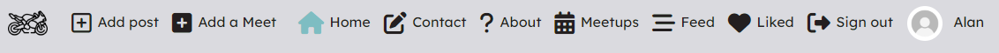
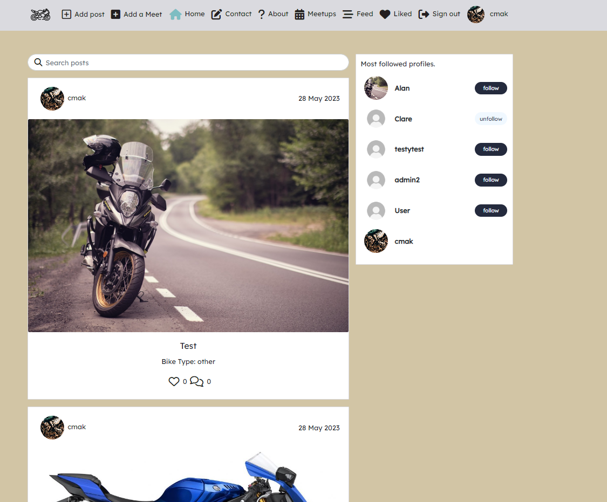
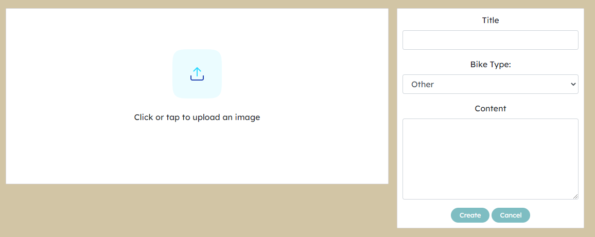
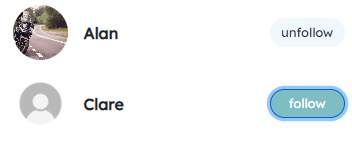

# Bike Bros

# Introduction 

Bike bros is intended to be a site for Motorcycle enthusiasts to come together.
The site allows users to and share photos of their bikes. 
The app also encourages users to create Bike Meets where like-minded people can meet to show off their bikes. 

# Deplyed FRONTEND website 
A link to the live website can be found [here](https://fe-bike-bros.herokuapp.com/)

# Deployed BACKEND website 
A link to the live website can be found [here](https://bike-bros.herokuapp.com/)

# DRF README
A link to the BACKEND README can be found here [here](https://github.com/JoeQuigley1/pp5-drf-bike-brothers)

## UX 

### Purpose

The site is designed give an interactive space for bike-enthusiasts to share bike related content, meetup and to find out more about bikes.

### Site Goals

Bike Bros aims to establish a sense of community among its users through the sharing of content, meetups and interactions both online and offline. 

### User Goals

To engage faithfully with the site and to share anything bike related so all users can make the most of what the site has to offer. 

### User Stories

The Issues created for this site can be found [here](https://github.com/JoeQuigley1/pp5-fe-bike-brothers/issues?q=is%3Aissue+is%3Aclosed)

The Kanban board can be found [here](https://github.com/users/JoeQuigley1/projects/9) and a link to the User Stories can be found [here](src/assets/readme_screenshots/userstories.md)

### wireframes

- Wireframes for my project can be found [here](/src/assets/wireframes/)

### Site structure

### Color Scheme

### Typography
- The font I chose to use in my app is "Lexend" as it is a widely used font, and very user-friendly. This allows a better user experience when reading content. 

### Feature Planning 

-	Neutral colour scheme to make the site easy to view.
-	Navigation which is user friendly and available on all pages so users can easily access the desired page
-	Restricted navigation for logged out users
-	Full Navigation functionality for logged in users
-	Posts – Logged in users can create edit read and delete bike related posts. 
-	Search posts: Search bar is displayed in Home Feed and Liked pages where users can search by title and user.
-	Comments: Users can create edit and delete comments under posts 
-	Likes: Users can like posts
-   Follow and unfollow: To see more content from the people I follow. 
-	Meetups – Logged in users can create edit read and delete meetups. 
-	Users can sign in and sign out.
-	Users can edit their profiles.
-	Form validation will help communicate errors to the user.

## Features

### Existing Features:
- Navbar

Achieve through the use of CurrentUserContext

Logged In: 

Sign up

Sign in

Hamburger 

UseClickOutsideToggle.js used to enhance the user experience when using the Hamburger menu

-Home Page which includes the posts lists

Post Detail

Create Post

Edit Post

Comments

Likes 

Profiles

- Avatar component 

- Follow and Un Follow
Possible through the use of ProfileDataContext.js

- Most Followed Profiles

Meetups

- Meetup Detail

- Meet Up Create form

Possible through the use of DropdownMenu.js component

- Meetup Edit Form

About

FAQ Accordion section

Contact Form

Confirmation 

### Future Features to Implement(Not included in this project)

- A Booking section in the meetup section where users can book into a meetup
- Add an option to like a meetup 
- Add a review section to the Meetups 
- A Chat feature where logged in users can communicate directly. 

## Testing

### Manual Testing
- Manual Testing can be found [here](/TESTS.md).

## Frameworks, Libraries & Programs Used
- [FontAwesome](https://fontawesome.com/): Used for the social links and icons. 
- [GoogleFonts](https://fonts.google.com/): Font: Used to for the font "Lexend" which is used throughout the project.
- [Gitpod](https://gitpod.io/): Used to build and create the project to Github.
- [Github](https://github.com/): Used to store my repository for submission.
- [Github Projects](https://docs.github.com/en/issues/planning-and-tracking-with-projects/learning-about-projects/about-projects): Github projects was use to create User Stories.
- [React Developer Tools](https://chrome.google.com/webstore/detail/react-developer-tools/fmkadmapgofadopljbjfkapdkoienihi): Plugin was used in tandem with Chrom DevTools to check for errors. 
- [LucidChart](https://www.lucidchart.com/): Used to design wireframes and mockups and Database mockups for the backend.
- [Favicon](https://favicon.io/): Used to provide the image for the icon and tab
- [Django](https://www.djangoproject.com/): Used to build the backend API for the front-end side of the project.
- [ReactJS](https://legacy.reactjs.org/docs/getting-started.html): Used to build the components in the front-end of the project.
- [AmIResponsive](https://ui.dev/amiresponsive)
- [React-Bootstrap](https://react-bootstrap-v4.netlify.app/): For the styling library used in the project, introduced in the walkthrough during the course. 

## Components

- AxiosDefault.js: Allows communication to the backend API
- Assest.js: Used to load a spinner when loading throughout the site.
- Avatar.js: Used to display the profile image throughout the site.
- DropdownMenu.js: Used to allow users to edit and delete their Meetup and Posts
- FaqAccordion.js: Custom component used to display the FAQ questions and answers. 
- CurrentUserContext.js: Used to allow users further functionality such as edit/delete once logged in.
- ProfileDataContext.js: Used to allow logged-in users to follow/unfollow other users.
- UseClickOutsideToggle.js: Used to collapse the navbar burger menu when an item or an area outside the menu is clicked.
- useRedirect.js: Redirects user to another page if they do not have appropriate access. 
- utils.js: Supplies Infinite Scroll functionality and JWT functionality accross entire app. 

# Project Setup and Initial Deployment

1. Create a new repository in GitHub (do not use CI Template).

2. Create new workspace by clicking 'Gitpod' button. 

3. Once workspace has loaded, run terminal command `npx create-react-app . --use-npm` to create React app. 
This Step raised an error which was consistent throughout the project. 

4. To create the app with Gitpod I used `nvm install 16 && nvm use 16` which created the app successfully. 

5. Once the app is installed, run terminal command `npm start` to check app is working. Browser should open with the spinning React logo on a dark blue background. 

6. Remove logo import from the top of App.js, and replace the React Header element with a custom h1 element containing 'Hello World!'. 

7. Confirm the changes have rendered in the browser preview then add, commit and push changes. 

8. Create a new app in Heroku. 
-   Click "New" and Create new app"
-   Choose an app name and region

9. Click on 'Deploy tab and go to the 'Deployment Method'. Click on Github.

10. Connect to a Github account and search for the relevant repository.

11. Use 'Manual Deply and click 'Deploy Branch'. Click on 'build logs' to monitor the build. 

12. Click open app to view the deployed app.

13. To install Bootstrap, run terminal command `npm install react-bootstrap@1.6.3 bootstrap@4.6.0`

# Final Deployment

1. In 'scripts' section of 'package.json' in gitpod, add the followin command: 
"heroku-prebuild: "npm install -g serve"

2. Add Procfile to project root & populate with the following:

web: serve -s build

3. Ensure all code is pushed to Github and up to date. 

4. Log into Heorku.

5. From the Dashboard lick on 'Deploy tab.

6. Use 'Deploy Branch' and Click on 'build logs' to monitor the build, wait for the build to complete. 

7. One the app has been deployed to Heroku click on the oppp app button. 

8. Test the Deployed app works. 

# Deployment Elephant SQL 

As of November 2022, Heroku ceased to provide a free service. The hosting of this website is carried out using the free service [Elephant SQL](https://www.elephantsql.com/). 

The steps used to deploy this project can be seen in steps 19-39 in the Deployment section of the BackEnd README [here](https://github.com/JoeQuigley1/pp5-drf-bike-brothers#deployment).

### Media

- Favicon and Logo by <a href="https://www.flaticon.com/free-icons/motorcycle" title="motorcycle icons">Motorcycle icons created by Freepik - Flaticon</a>
- Avatar and No Results images are from Code Institute Moments walkthrough project
- 404 image was <a href="http://www.freepik.com">Designed by gstudioimagen / Freepik</a>
- Bike images were taken from [Pexels](https://www.pexels.com)

### Credit 
- Code Institute: The base of this project comes from the Moments walkthrough used as guide when making this and building upon it to make the project my own.  
- Tutor support for their help in solving the **npx create-react-app . --use-npm** problem
- Stack Overflow for the wealth of knowledge 
- [React-Bootstrap](https://react-bootstrap-v4.netlify.app/)
- [W3Schools](https://www.w3schools.com/)
- [MDN Web Docs](https://developer.mozilla.org/en-US/)
- [React Documentation](https://legacy.reactjs.org/versions)

## Acknowledgements 

- [Martina Terlevic](https://github.com/SephTheOverwitch): For help and support throughout a tough year.
- Tutor support for their help throughout the course and in solving the **npx create-react-app . --use-npm** to get me started. 
- Slack for the huge archive of helpful information

- A final acknowlegement to my late mother Breda who sadly passed away before I finished this course. She was a constant support to me and is and always will be greatly missed.  
