#### Crud Functionality:
|Posts| Comments | Likes | Meetups | Follow | Profile |
|---|---|---|---|---|---|
|Profile|A user can create and edit a profile and bio|pass|pass|n/a|as expected|
|Comments|A user can create, delete and edit comments on posts|pass|pass|pass|n/a|
|Likes|A user can like/unlike a post|pass|n/a|pass|n/a|
|Meetups|A user can create, edit and delete a meetup|pass|pass|pass|as expected|
|Follow|A user can follow/unfollow other users|pass|n/a|pass|n/a|
|Post|A user can create, edit and delete a post|pass|pass|pass|as expected|
- CRUD functionality has been tested and is working on the above. 
- Profiles do not have have delete functionality.
- Likes and Comments can only be created and deleted.
- All links work and lead to the desired page

## Feature Testing

## User Story Testing

### Authentication

#### Sign up
- As a user I can sign up and register as a user so that I can gain full access to the site

Sign up Test

User is requested to create credentials

Data is sent to the BE API

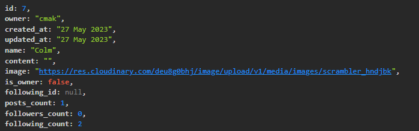

User is then redirected to the Sign In page

#### Sign In

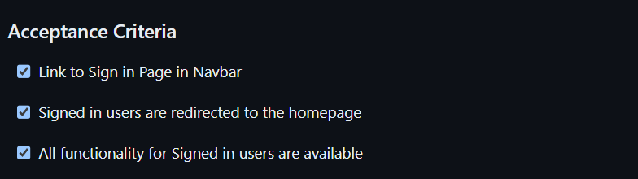

User must provide credentials to gain full access.

Once Signed in the User is then redirected to the Home Page which includes the Posts and Most Followed Profiles.

All App functionality is then available via Navbar. 

#### Navbar

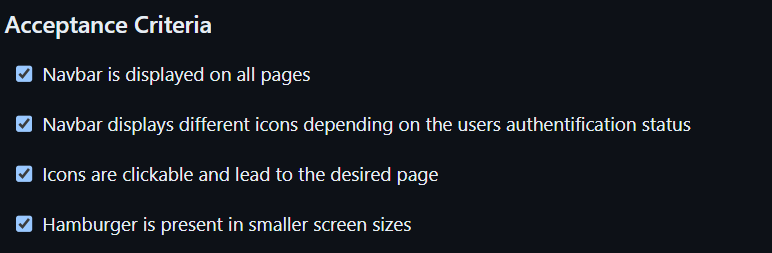

Navbar displays different icons depending on authenication status

Logged out Navbar: 

Logged In Navbar: 

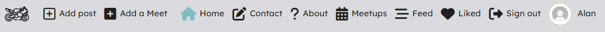

Navbar Hamburger:

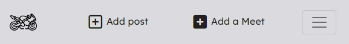

Hamburger Icons

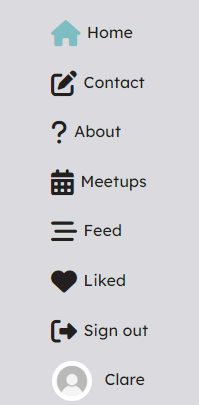

All icons are clickable on all displays and lead the User to the desired page.

#### Contact Page

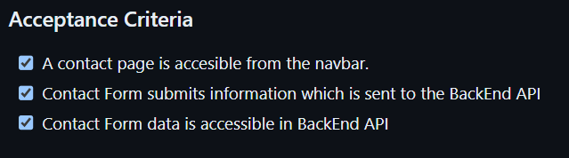

Contact Form is displayed once the contact button on the Navbar is clicked.

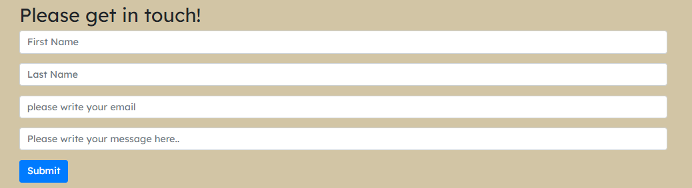

Once the form is completed the Data is sent to the BackEnd API.

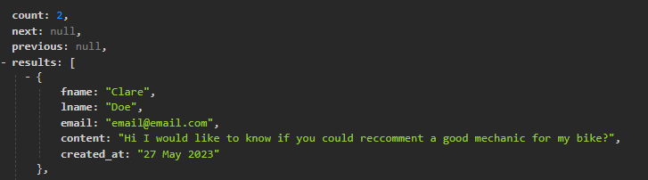

The User is then redirected to a Confirmation Page to assure them that their query has been received.

#### Confirmation Page

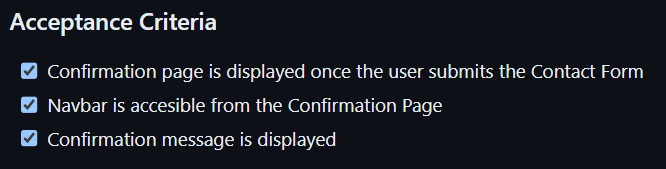

After submitting the Contact Form the user is then redirected to the Confirmation Page which includes a message and access to the navbar.

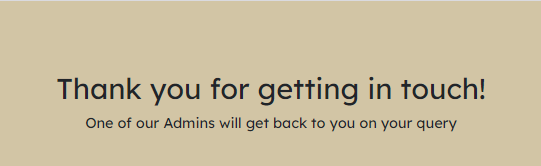

### Validator Testing

#### ES Lint

#### W3C Css

### Lighthouse Testing 