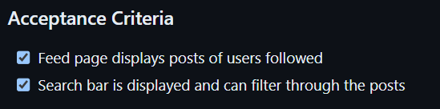
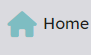
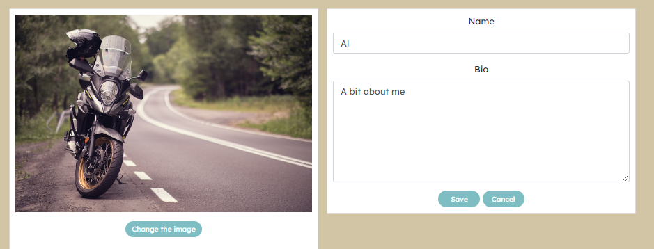
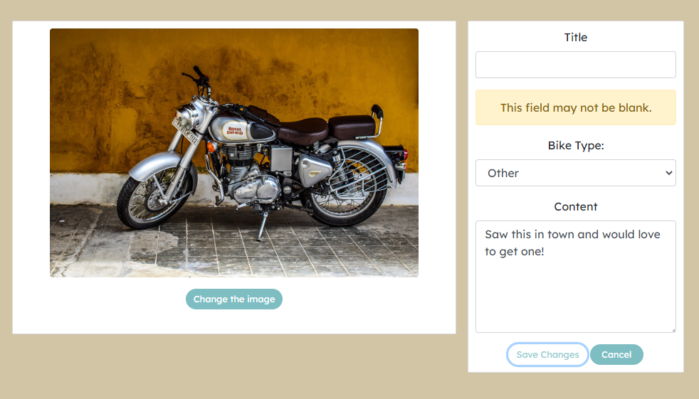

## User Story Testing

### Authentication

#### Sign up
*As a user I can sign up and register as a user so that I can gain full access to the site*


Sign up Test


User is requested to create credentials

Data is sent to the BE API


User is then redirected to the Sign In page

#### Sign In

*As a user I can Sign in to the app so that I can gain access to all features available for a signed in user*


User must provide credentials to gain full access.


Once Signed in the User is then redirected to the Home Page which includes the Posts and Most Followed Profiles.

All App functionality is then available via Navbar. 

### Navigation

#### Navbar

*As a user you can view a navbar from every page so that I can navigate easily betwen pages*


Navbar displays different icons depending on authenication status

Logged out Navbar: 


Logged In Navbar: 


Navbar Hamburger:


Hamburger Icons


All icons are clickable on all displays and lead the User to the desired page.

#### Search Bar

*As a user I can for posts title and user, so that I can find the posts and user profiles I am most interested in.*


Users can use the search bar on the Home Page, Feed Page and Like Page to search for posts


### Home Page

*As a user I can navigate to the Home Page so that I can see all posts.*


Once the User click the Home icon they are redirected to the Home page.

All posts are displayed on the Home Page

Search bar is displayed and can filter posts by user and title


### Feed Page

*As a user I can navigate to the feed page so that I can see the posts of user I follow*



Once a user clicks the feed icon they are redirected to the feed page where posts from users they follow


### Like Page

*As a user I can navigate to the liked page so that I can quickly see all of the posts that I have liked*


Once a User navigates to the Liked Page all liked posts are displayed

The search bar is displayed and the user can filter by post title and user


### Contact

#### Contact Page
*As a User I can Contact the site admin of the site through a contact Form*


Contact Form is displayed once the contact button on the Navbar is clicked.


Once the form is completed the Data is sent to the BackEnd API.


The User is then redirected to a Confirmation Page to assure them that their query has been received.

#### Confirmation Page

*As a user I can contact the admin directly so that I can can ask question or give feedback.*


After submitting the Contact Form the user is then redirected to the Confirmation Page which includes a message and access to the navbar.


### About 

*As a user I can navigate to an about page so that I can get more information about the site*


The User can navigate to the About page through a link in the navbar.

The User is then directed to the About Page.


### Meetups

#### Create

*As a user I can create a meetup so that I can organise an event to meet with other like-minded bike enthusiatsts*


Once the User clicks the "Add a Meetup" button in the navbar they are redirected to the Create Meetup Form


Once the form is submitted the data is then sent to the BE API


#### View

*As a user I can view a bike Meet up so that I can see the details of meetups planned.*


Once a Meetup is created it is displayed on the Meetups Page.


Clicking the title will direct the user to the Meetup detail.

#### Edit

*As an owner of a meetup I can Edit a Meetup so that I can update the Meetup*


As an owner of a meetup, a User has the option of editing their meetup through the three dots menu


For content that is posted by another user the three dots menu is not visible.


As an owner the three dots menu is visible


Once clicked the User is redirected to the Edit Meetup Page where they can make changes to their meetup.


The edited data is succesfully sent to the BE API


Once saved the User is redirected to the Meetup Detail.

The edited Meetup is also visible on the meetups Page and as a detail


#### Delete

*As an owner of a meetup I can choose to delete a Meetup so that if an event is no longer taking place it is removed form the application*


The User can click the delete button from the three dot menu as seen above in the Edit Meetup section


Once the User clicks the delete button they are redirected back to the previous page.

The data is deleted from the BE API

### Posts

#### Create

*As a logged in user I can create posts so that I can share content with fellow users*


Post form is accessible from the "Add a post" icon in the navbar

Post create form is rendered. 


Once a User submits their post they are redirected to the Post Detail


The data is sent to the BE API


#### Edit

*As an owner of a post I can edit posts so that I can correct any errors*


Using the three dots menu a User can navigate to the Edit Post Form.


Once clicked the User is directed to the Edit Form 


Once submitted the edited data is sent to the BE API


#### Delete

*As an owner of a post I can delete the post so that I can control what content I have on the app.*


Using the three dot menu a User can click the delete icon which will delete the post. 


The Data is then delete from both the FE and the BE. 

#### View

*As a user I can see the most recent posts so that I can be up to date with new posts*


Using the Home icon on the navbar a User can navigate to the posts page



Once clicked the User is redirected to the home page which contains a lists of posts


The most recent posts are displayed at the top. 

The main image of a post is clickble and redirects the user to the Post Detail.

#### Detail

*As a user I can view the posts page so that I can see the details of the post.*


Once a User clicks on a post they are redirected to the Post Detail 


The Post details are displayed. 

There is a comment section below the post where users can interact

### Infinite Scroll

*As a user I can keep scrolling through the content on the site and content is loaded for me automatically so that I don't have to click on next page*


### Comments

#### Create

*As a logged in user I can add comments to a post so that I can share my thoughts about the post*


Through the comment form a Users is able to create a comment. 


The comment is then displayed under the post.


 
The comment data is sent to the BE API

#### Edit

*As an owner of a comment I can edit comments on a post which I have made so that I can correct any mistakes*


A user can use the three dots menu and click the edit icon. 

Once clicked this will open the comment for editing. 


The updated comment is displayed under the post


The data is updated on the BE API


#### Delete

*As an owner of a comment I can delete my comment so that I can control removal of my comment from the application.*


Using the three dots menu a comment can be deleted. 

Once deleted the comment is no longer displayed and the data is removed from BE API


#### View

*As a user I would like to read comments made by other users so that I can connect with the community*


Comments are displayed under the post

The number of comments are displayed beside the comment icon


### Like

#### Create and Delete

*As a user I can like and unlike a post so that I can show my support for the posts that interest me*


By using the like icon under a post a User can like a post which they do not own. 


Once liked the likes are displayed under the post.


The data is sent to the BE API.


Once the like icon is clicked again the like is removed from the post and deleted on the BE API.

### Profile

#### View

*As a user I can view information about a specific user: username, name, bio, number of posts, posts, number offollows and users followed so that I can learn more about them*


Once a User clicks on a profile name or avatar on the post list or the profile image on the followers list they are redirected to the Profile Display


All of the profile details are displayed and a list of posts are under the proile. 

The profile data is stored in the BE API


#### Edit

*As a user I can edit my profile so that I can update or change my information.*


A User can update their profile through the three dot menu where they are given the choice of editing their profile, changing their username and changing password.


Once the user clicks on the desired icon they are directed to an edit form for each. 

They can edit the user name


Edit the Password


Profile before editing


Edit the Profile details



Once changes are made they are displayed in the Profile Detail


The changes are saved to the BE API


### Followers

#### Follow and Unfollow

*As a user I can follow and unfollow other users so that I can see their content on the feed page*


Users can follow and unfollow profiles through the follow and unfollow button


Once a profile is follower or unfollowed the data is stored or deleted in the BE API


#### Most followed

*As a user I can view the most followed profiles of other users profiles so that I can see which profiles are popular.*


Most Follower Profiles is visible on Home, Meetups, Feed and Liked pages

The most followed Profiles are displayed with the username and avatar so they can be navigated to the profile display


#### Crud Functionality:

| Feature | Expected Result |    Actual Result   | Development|Deployment| Comments |
|-------|-----|----|----|----|------|
|Profiles|Profile can be created |As Expected|Pass|Pass|N/A|
|Profiles|Profile can be edited through the edit profile form |As Expected|Pass|Pass|As Owner|
|Profile Password|Profile passwords can be edited by the edit password form |As Expected|Pass|Pass|As Owner|
|Profiles|Profile Usernames can be edited by the username edit form |As Expected|Pass|Pass|As Owner|
|Posts| Post can be created through the create form|As Expected|Pass|Pass|N/A|
|Posts| Post can be edited through the edit form|As Expected|Pass|Pass|As Owner
|Posts| Post can be deleted by the three dot menu|As Expected|Pass|Pass|As Owner
|Comments| Comment can be created|As Expected|Pass|Pass|N/A|
|Comments| Comment can be edited|As Expected|Pass|Pass|As Owner|
|Comments| Comment can be deleted|As Expected|Pass|Pass|As Owner|
|Likes| Likes can be created|As Expected|Pass|Pass|N/A|
|Likes| Likes can be deleted|As Expected|Pass|Pass|As Owner|
|Followers| Followers can be created by the follow button|As Expected|Pass|Pass|N/A|
|Followers| Followers can be deleted by the unfollow button |As Expected|Pass|Pass|As Owner|
|Meetups|Meetup can be created through the meetup form|As Expected|Pass|Pass|N/A|
|Meetups |Meetup can be edited through the edit form|As Expected|Pass|Pass|As Owner|
|Meetups |Meetup can be deleted by the three dot menu|As Expected|Pass|Pass|As Owner|
|Contact|Contact  can be created by the contact form|As Expected|Pass|Pass|Contact details are intented to be adressed by admin therefore no display is provided in the FE|


### Bugs

#### Fixed bugs

1. A Bug was noticed when Deleting the Post and Meetup pages. 

When a user edits a post and then immediately deletes the post, the user was then redirected to the edit form page of the deleted post. This error occurred because of the history.goBack() call on the handle Delete function used in Post and Meetup. 

The bug was fixed by replacing the goBack() call with a history.push(`/`) and history.push(`/meetups`) which sends the user to the Home Page rather than the deleted id url. 


2. There was a bug in the Form Validation where the Date and Time fields in the meetups threw an error when editing.

Both fields are intentionally left as not required fields and therefore should not throw an error. 


After some help from Joanne at tutor support we found a solution which was adding an if statement the formData.append() call.
```
    if (date) formData.append("date", date);
    if (time) formData.append("time", time);
```

#### Un fixed bugs

There are no unfixed bugs found during testing. 


### Form Validation

#### Posts

| Feature | Expected Result |    Actual Result   |Deployment| Comments |
|-------|-----|----|----|----|
|Create Form| Prompts should display when required fields are left blank |As Expected|Pass | Content and bike type are not required|
|Edit Form| Prompts should display when required fields are left blank |As Expected|Pass |  Content and bike type are not required|

Screenshots of posts:




#### Meetups

| Feature | Expected Result |    Actual Result   |Deployment| Comments |
|-------|-----|----|----|----|
|Create Form| Prompts should display when required fields are left blank |As Expected|Pass | Content, Date and Time are not required
|Edit Form| Prompts should display when required fields are left blank |As Expected|Pass | Content, Date and Time are not required


#### Contact
| Feature | Expected Result |    Actual Result   |Deployment| Comments |
|-------|-----|----|----|----|
|Create Form| Prompts should display when required fields are left blank |As Expected|Pass | Email field has an extra check to prompt email format


As the contact data is intended to be adressed by the Admin directly, the email field needing email format and subsequent prompts are for UX purposes.   

### Validator Testing


#### ESLint

I used [ESlint](https://eslint.org/) to manually test the jsx files

|Folder |Files | Result | Comments|
|---|---|---|---|
|api|axiosDefaults.js|PASS|N/A|
|components |Asset.js, Avatar.js, FaqAccordion.js, MoreDropDown.js, NavBar.js, NotFound.js|PASS|N/A|
|contexts|CurrentUserContext.js, ProfileDataContext.js|PASS|N/A|
|hooks|useClickOutsideToggle.js, useRedirect.js|PASS|N/A|
|about|About.js |PASS|N/A|
|auth| SignInForm.js, SignUpForm.js |PASS|N/A|
|comments|Comment.js, CommentCreateForm.js CommentEditForm.js|PASS|N/A|
|contact|Confirmation.js, CreateContactForm.js|PASS|N/A|
|meetups|Meetup.js, MeetupCreateForm.js, MeetupEditForm.js, MeetupPage.js, MeetupsPage.js|PASS|N/A|
|posts|Post.js, PostCreateForm.js, PostEditForm.js, PostPage.js, PostsPage.js|PASS|N/A|
|profiles|PopularProfiles.js, Profile.js, ProfileEditForm.js, ProfilePage.js, UsernameForm.js UserPasswordForm.js|PASS|N/A|
|utils|utils.js|PASS|N/A|

- There are no major issues impacting functionality of the application.


#### W3C Css

All CSS code passes through a validator with no errors. 


### Lighthouse Testing 

The site scores highly on several fields. 


The loading time for images on the site was a major contributor to the lower performance score. 


### Responsive Design 

The site has been tested using several browsers including: Google Chrome, Firefox, and Microsoft Edge browsers. 

The site was tested on several screen sizes and device sizes. 
